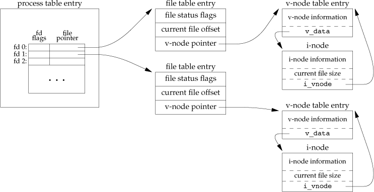

The kernel uses **three** data structures to represent an open file, and the relationships among them determine the effect one process has on another with regard to **file sharing**.

**kernel data structures for open files:**

1. Every process has an entry in the process table. Within each process table entry is a table of open file descriptors, which we can think of as a vector, with one entry per descriptor. Associated with each file descriptor are: 
(a) The file descriptor flags
(b) A pointer to a file table entry

2. The kernel maintains a file table for all open files. Each file table entry contain
(a) The file status flags for the file, such as read, write, append, sync, and nonblocking.
(b) The current file offset
(c) A pointer to the v-node table entry for the file

3. Each open file (or device) has a v-node structure that contains information about the type of file and pointers to functions that operate on the file. For most files, the v-node also contains the i-node for the file. This information is read from disk when the file is opened, so that all the pertinent information about the file is readily available. For example, the i-node contains the owner of the file, the size of the file, pointers to where the actual data blocks for the file are located on disk, and so on.

Linux has no v-node. Instead, a generic i-node structure is used. Although the implementations differ, the v-node is conceptually the same as a generic i-node. Both point to an i-node structure specific to the file system.

Linux uses a file system–independent i-node and a file system–dependent i-node.

We assume here that the first process has the file open on descriptor 3 and that the second process has that same file open on descriptor 4. Each process that opens the file gets its own file table entry, but only a single v-node table entry is required for a given file. One reason each process gets its own file table entry is so that each process has its own current offset for the file.

• After each write is complete, the current file offset in the file table entry is incremented by the number of bytes written. If this causes the current file offset to exceed the current file size, the current file size in the i-node table entry is set to the current file offset (for example, the file is extended).

• If a file is opened with the O_APPEND flag, a corresponding flag is set in the file status flags of the file table entry. Each time a write is performed for a file with this append flag set, the current file offset in the file table entry is first set to the current file size from the i-node table entry. This forces every write to be appended to the current end of file.

• If a file is positioned to its current end of file using lseek, all that happens is the current file offset in the file table entry is set to the current file size from the i-node table entry. (Note that this is not the same as if the file was opened with the O_APPEND flag, as we will see in Section 3.11.)

• The lseek function modifies only the current file offset in the file table entry. No I/O takes place.

Traditional implementations of the UNIX System have a buffer cache or page cache in the kernel through which most disk I/O passes. When we write data to a file, the data is normally copied by the kernel into one of its buffers and queued for writing to disk at some later time. This is called delayed write. 

The sync function simply queues all the modified block buffers for writing and returns; it does not wait for the disk writes to take place.

The function sync is normally called periodically (usually every 30 seconds) from a system daemon, often called update. This guarantees regular flushing of the kernel’s block buffers. The command sync(1) also calls the sync function.

The function fsync refers only to a single file, specified by the file descriptor fd, and waits for the disk writes to complete before returning. This function is used when an application, such as a database, needs to be sure that the modified blocks have been written to the disk.

The fdatasync function is similar to fsync, but it affects only the data portions of a file. With fsync, the file’s attributes are also updated synchronously.

